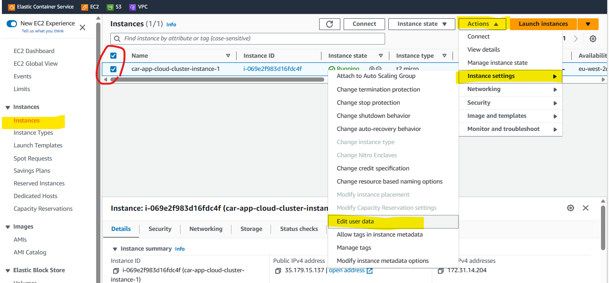
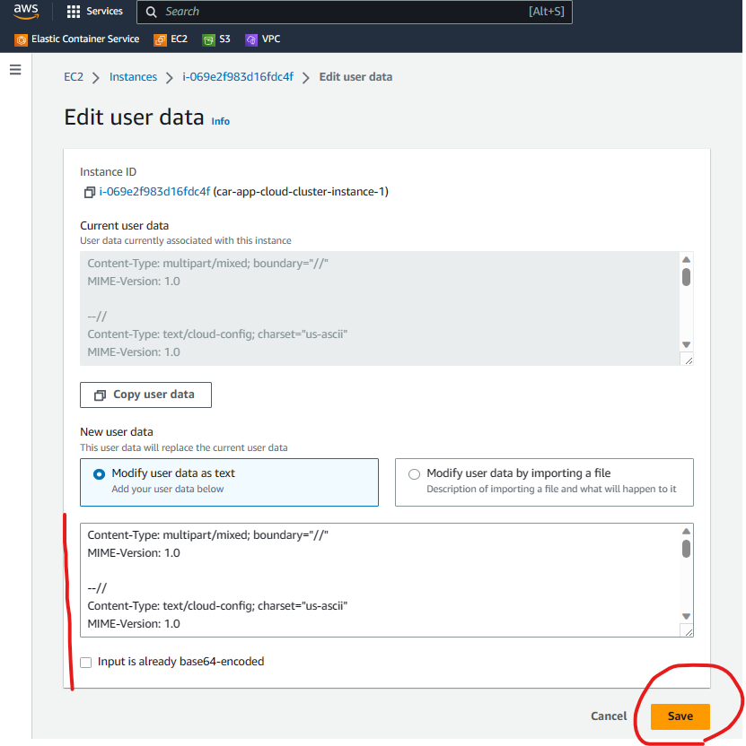
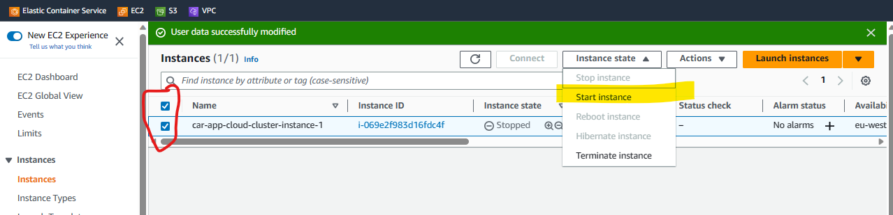
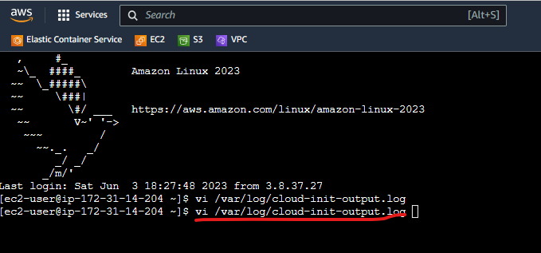
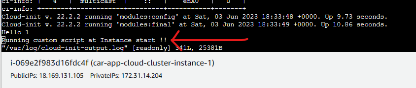
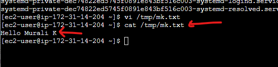

# AWS EC2 Management

### EC2 Connect

#### User Data
* These are items such as start up scripts to run on instance create and star.


* The "script" to run.


* Start the instance.


* The script.
````shell
Content-Type: multipart/mixed; boundary="//"
MIME-Version: 1.0

--//
Content-Type: text/cloud-config; charset="us-ascii"
MIME-Version: 1.0
Content-Transfer-Encoding: 7bit
Content-Disposition: attachment; filename="cloud-config.txt"

#cloud-config
cloud_final_modules:
- [scripts-user, always]

--//
Content-Type: text/x-shellscript; charset="us-ascii"
MIME-Version: 1.0
Content-Transfer-Encoding: 7bit
Content-Disposition: attachment; filename="userdata.txt"

#!/bin/bash
/bin/echo "Hello Murali K" >> /tmp/mk.txt
/bin/echo "Running custom script at Instance start !!"
--//--
````
* Check in Console.


 

### CLI
