# AWS EC2 Tools

### Table of Contents

1. [AWS CLI](#awsCli)
2. [Consul](#consul)
2. [Terraform](#terraform)
3. [Nomad](#nomad)
4. [Vault](#vault)

<a name="awsCli"></a>
### AWS CLI
#### Install AWS CLI
https://docs.aws.amazon.com/cli/latest/userguide/getting-started-install.html
Ensure `C:\Program Files\Amazon\AWSCLIV2\ ` is in the PATH. 
#### Create Credentials
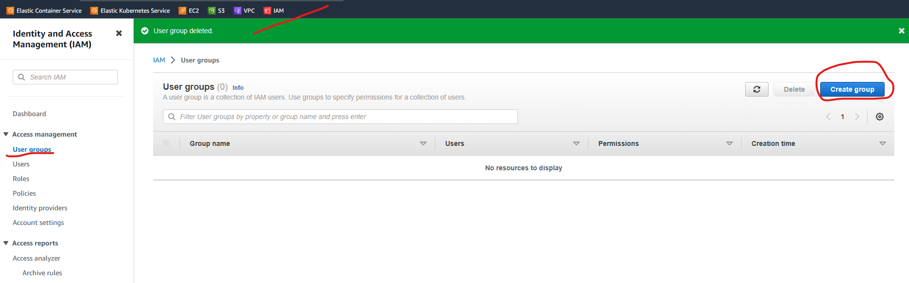<br>
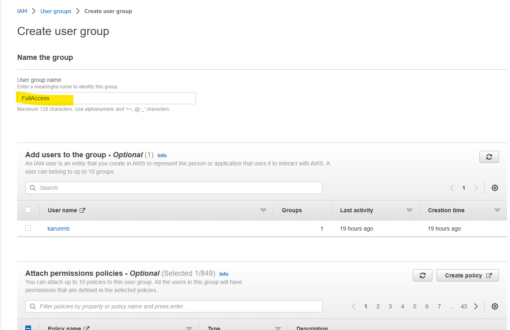<br>
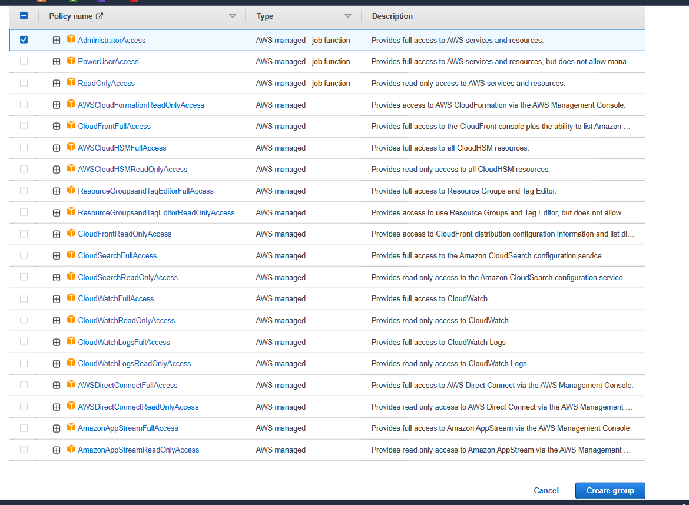<br>
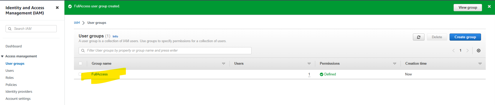<br>
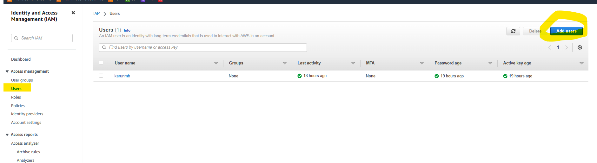<br>
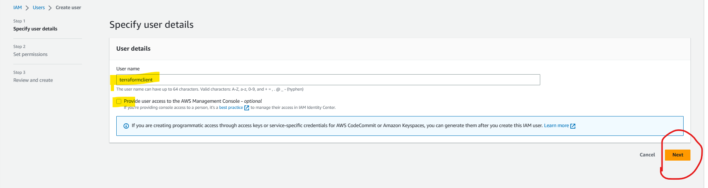<br>
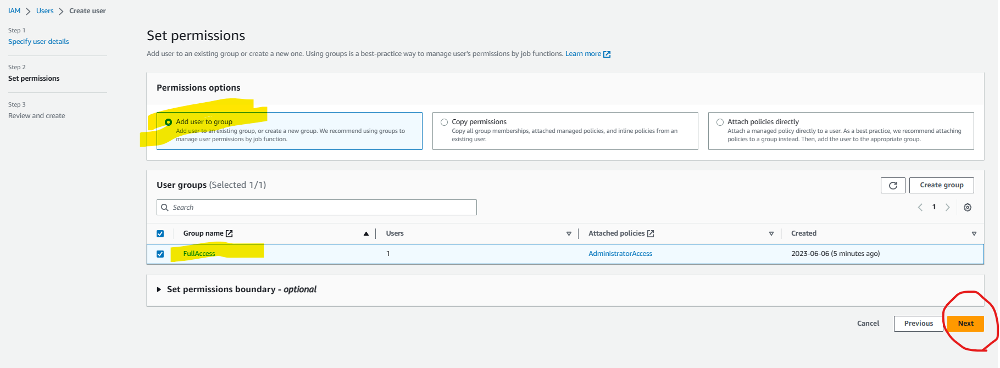<br>
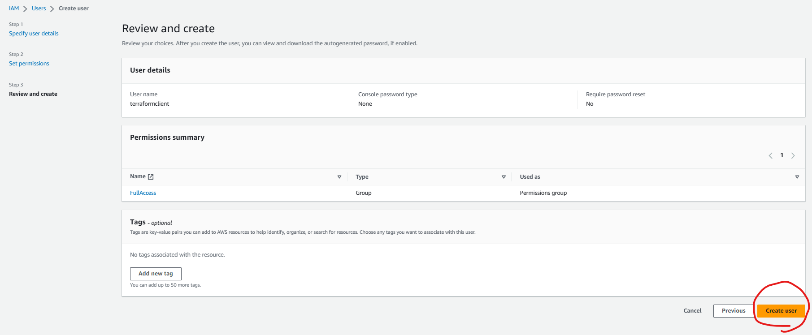<br>
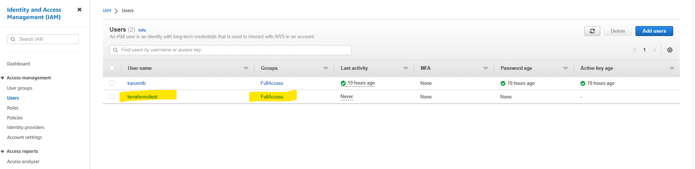<br>
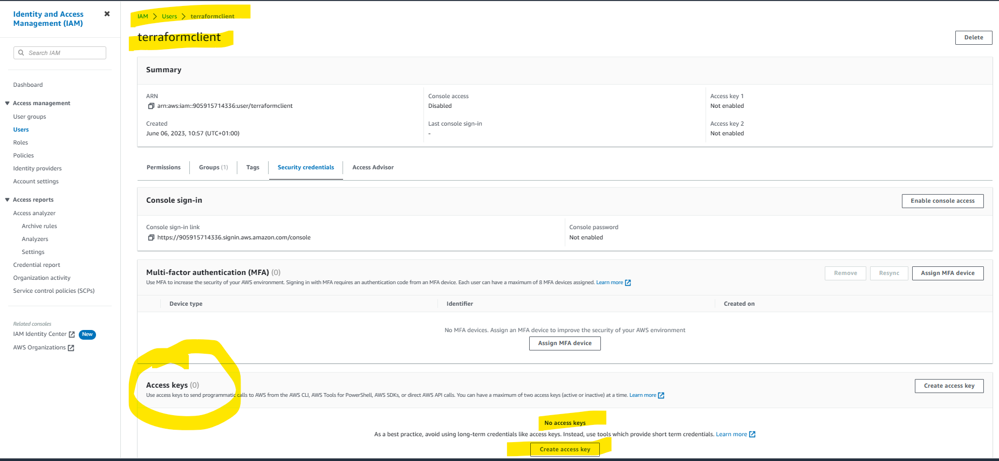<br>
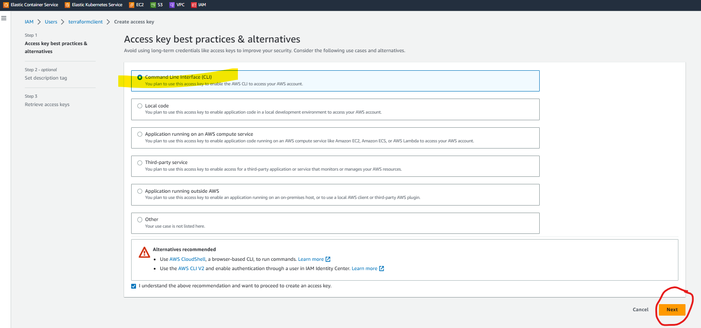<br>
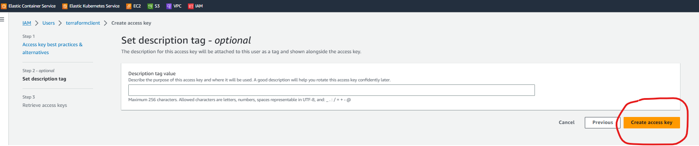<br>
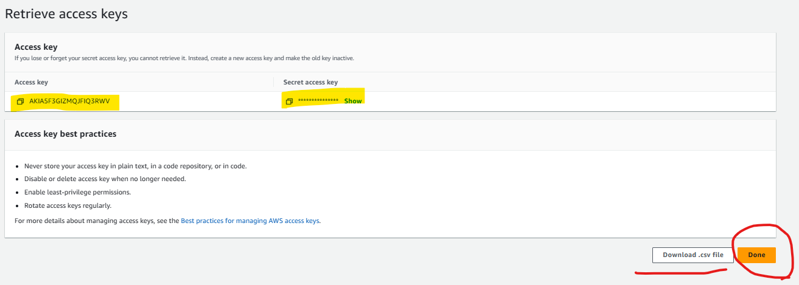<br>

#### Configure AWS CLI
##### Configure
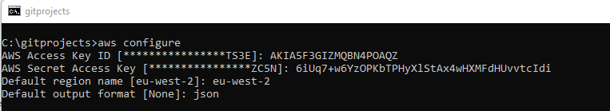<br>
<a name="awsCliCred"></a>
##### Validate Credentials
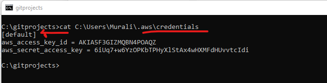<br>

<a name="consul"></a>
### Consul

#### Install Consul
https://www.hashicorp.com/products/consul

#### Run Consul
`consul agent -dev -node MyConsul -http-port=8501`

-node : Name of the node<br>
-http-port : The port to use (if not used defaults to 8500)<br>
````shell
C:\Apps\Consul>consul agent -dev -node MyConsul -http-port=8501
==> Starting Consul agent...
              Version: '1.15.2'
           Build Date: '2023-03-30 17:51:19 +0000 UTC'
              Node ID: '994357ab-11b0-ea96-7fa3-34e7905e18dc'
            Node name: 'MyConsul'
           Datacenter: 'dc1' (Segment: '<all>')
               Server: true (Bootstrap: false)
          Client Addr: [127.0.0.1] (HTTP: 8501, HTTPS: -1, gRPC: 8502, gRPC-TLS: 8503, DNS: 8600)
         Cluster Addr: 127.0.0.1 (LAN: 8301, WAN: 8302)
    Gossip Encryption: false
     Auto-Encrypt-TLS: false
            HTTPS TLS: Verify Incoming: false, Verify Outgoing: false, Min Version: TLSv1_2
             gRPC TLS: Verify Incoming: false, Min Version: TLSv1_2
     Internal RPC TLS: Verify Incoming: false, Verify Outgoing: false (Verify Hostname: false), Min Version: TLSv1_2
````
Check in Conul.<br>
http://localhost:8501/ui/dc1/services
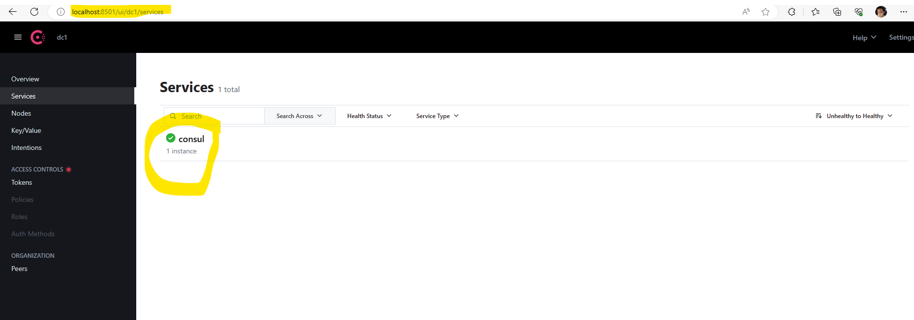<br>

#### Service registry
E.g. in ``application.yml``
````yaml
spring:
  cloud:
    discovery:
      enabled: true
    consul:
      host: localhost
      port: 8501
      discovery:
        instanceId: ${spring.application.name}:${spring.application.instance_id:${server.port}:${random.value}}
      config:
        enabled: false
````

<a name="terraform"></a>
### Terraform

#### Install Terraform
https://developer.hashicorp.com/terraform/downloads

#### Setup Terraform
##### Run Terraform
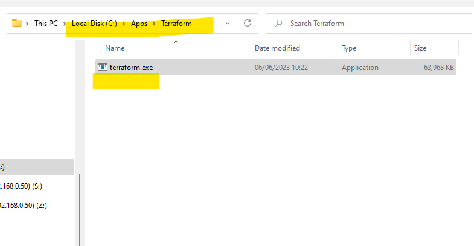<br>
##### Validate it is installed
``terraform -help``<br>
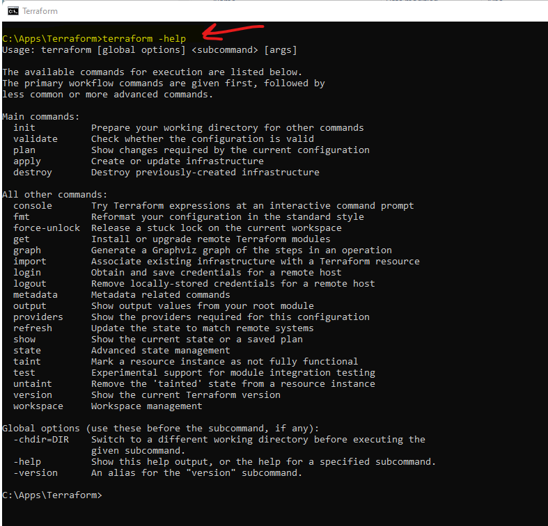<br>
##### Create the Provider block in .tf file
Start to create the .tf file with the provider "aws".<br> 
The profile default must match the AWS CLI profile [See Here](#awsCliCred).<br>
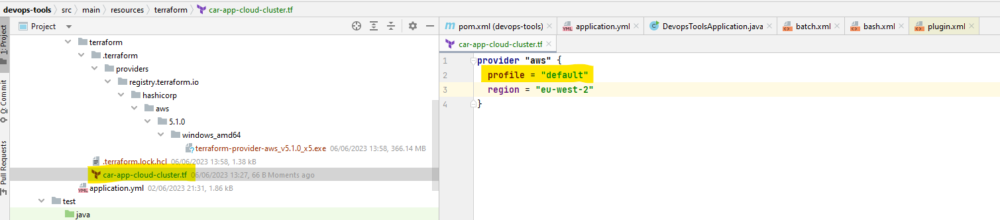<br>
##### Install the aws provider
``terraform init``<br>
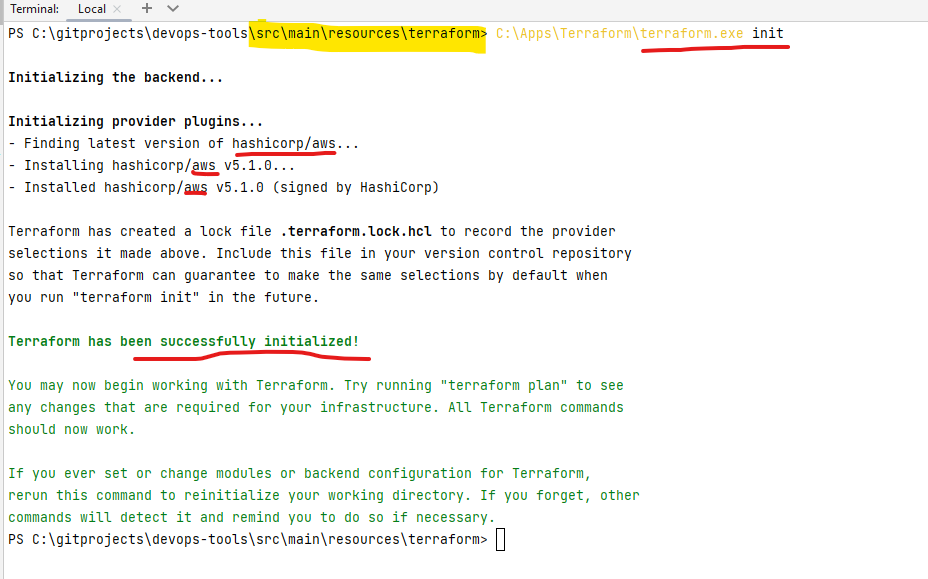<br>
##### Create the Resources Block in .tf file
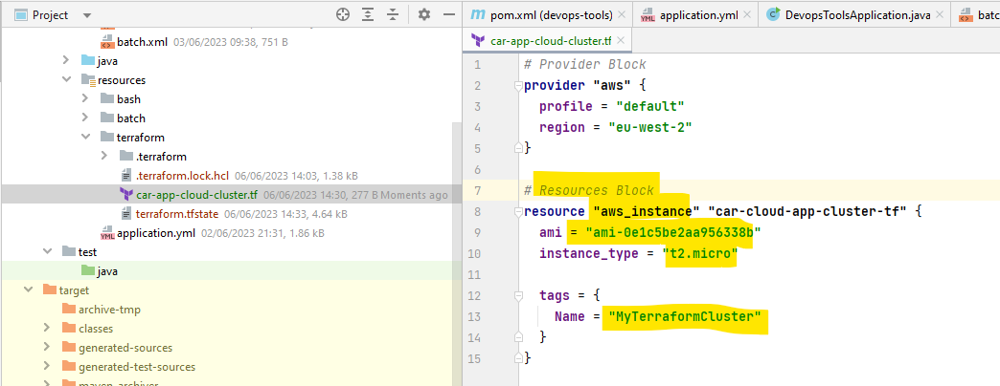<br>
##### Set up the infrastructure
Run ```terraform apply```
```shell
PS C:\gitprojects\devops-tools\src\main\resources\terraform> C:\Apps\Terraform\terraform.exe apply

Terraform used the selected providers to generate the following execution plan. Resource actions are indicated with the following symbols:
  + create

Terraform will perform the following actions:

  # aws_instance.car-cloud-app-cluster-tf will be created
  + resource "aws_instance" "car-cloud-app-cluster-tf" {
      + ami                                  = "ami-0e1c5be2aa956338b"
      + arn                                  = (known after apply)
      + associate_public_ip_address          = (known after apply)
      + availability_zone                    = (known after apply)
      + cpu_core_count                       = (known after apply)
      + cpu_threads_per_core                 = (known after apply)
      + disable_api_stop                     = (known after apply)
      + disable_api_termination              = (known after apply)
      + ebs_optimized                        = (known after apply)
      + get_password_data                    = false
      + host_id                              = (known after apply)
      + host_resource_group_arn              = (known after apply)
      + iam_instance_profile                 = (known after apply)
      + id                                   = (known after apply)
      + instance_initiated_shutdown_behavior = (known after apply)
      + instance_state                       = (known after apply)
      + instance_type                        = "t2.micro"
      + ipv6_address_count                   = (known after apply)
      + ipv6_addresses                       = (known after apply)
      + key_name                             = (known after apply)
      + monitoring                           = (known after apply)
      + outpost_arn                          = (known after apply)
      + password_data                        = (known after apply)
      + placement_group                      = (known after apply)
      + placement_partition_number           = (known after apply)
      + primary_network_interface_id         = (known after apply)
      + private_dns                          = (known after apply)
      + private_ip                           = (known after apply)
      + public_dns                           = (known after apply)
      + public_ip                            = (known after apply)
      + secondary_private_ips                = (known after apply)
      + security_groups                      = (known after apply)
      + source_dest_check                    = true
      + subnet_id                            = (known after apply)
  Terraform will perform the actions described above.
  Only 'yes' will be accepted to approve.

  Enter a value: yes

aws_instance.car-cloud-app-cluster-tf: Creating...
aws_instance.car-cloud-app-cluster-tf: Still creating... [10s elapsed]
aws_instance.car-cloud-app-cluster-tf: Still creating... [20s elapsed]
aws_instance.car-cloud-app-cluster-tf: Creation complete after 21s [id=i-076d3780758b4b142]

Apply complete! Resources: 1 added, 0 changed, 0 destroyed.
```
##### Verify the instance is up in EC2 console
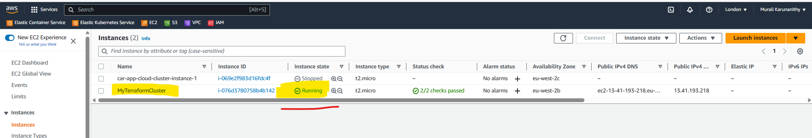<br>
##### Teardown the infrastructure
Run ```terraform destroy```
```shell
PS C:\gitprojects\devops-tools\src\main\resources\terraform> C:\Apps\Terraform\terraform.exe destroy
aws_instance.car-cloud-app-cluster-tf: Refreshing state... [id=i-076d3780758b4b142]

Terraform used the selected providers to generate the following execution plan. Resource actions are indicated with the following symbols:
  - destroy

Terraform will perform the following actions:

  # aws_instance.car-cloud-app-cluster-tf will be destroyed
  - resource "aws_instance" "car-cloud-app-cluster-tf" {
      - ami                                  = "ami-0e1c5be2aa956338b" -> null
      - arn                                  = "arn:aws:ec2:eu-west-2:905915714336:instance/i-076d3780758b4b142" -> null
      - associate_public_ip_address          = true -> null
      - availability_zone                    = "eu-west-2b" -> null
      - cpu_core_count                       = 1 -> null
      - cpu_threads_per_core                 = 1 -> null
      - disable_api_stop                     = false -> null
      - disable_api_termination              = false -> null
      - ebs_optimized                        = false -> null
      - get_password_data                    = false -> null
      - hibernation                          = false -> null
      - id                                   = "i-076d3780758b4b142" -> null
      - instance_initiated_shutdown_behavior = "stop" -> null
      - instance_state                       = "running" -> null
      - instance_type                        = "t2.micro" -> null
      - ipv6_address_count                   = 0 -> null
      - ipv6_addresses                       = [] -> null
      - monitoring                           = false -> null
      - placement_partition_number           = 0 -> null
      - primary_network_interface_id         = "eni-0d4cc5175a1beb930" -> null
      - private_dns                          = "ip-172-31-46-170.eu-west-2.compute.internal" -> null
      - private_ip                           = "172.31.46.170" -> null
      - public_dns                           = "ec2-13-41-193-218.eu-west-2.compute.amazonaws.com" -> null
      - public_ip                            = "13.41.193.218" -> null
      - secondary_private_ips                = [] -> null
      - security_groups                      = [
          - "default",
        ] -> null
      - source_dest_check                    = true -> null
      - subnet_id                            = "subnet-96b037da" -> null
      - tags                                 = {
          - "Name" = "MyTerraformCluster"
        } -> null
      - tags_all                             = {
          - "Name" = "MyTerraformCluster"
        } -> null
      - tenancy                              = "default" -> null
      - user_data_replace_on_change          = false -> null
      - vpc_security_group_ids               = [
          - "sg-54e4e52e",
        ] -> null

      - capacity_reservation_specification {
          - capacity_reservation_preference = "open" -> null
        }

      - cpu_options {
          - core_count       = 1 -> null
          - threads_per_core = 1 -> null
        }

      - credit_specification {
          - cpu_credits = "standard" -> null
        }

      - enclave_options {
          - enabled = false -> null
        }

      - maintenance_options {
          - auto_recovery = "default" -> null
        }

      - metadata_options {
          - http_endpoint               = "enabled" -> null
          - http_put_response_hop_limit = 2 -> null
          - http_tokens                 = "required" -> null
          - instance_metadata_tags      = "disabled" -> null
        }

      - private_dns_name_options {
          - enable_resource_name_dns_a_record    = false -> null
          - enable_resource_name_dns_aaaa_record = false -> null
          - hostname_type                        = "ip-name" -> null
        }

      - root_block_device {
          - delete_on_termination = true -> null
          - device_name           = "/dev/xvda" -> null
          - encrypted             = false -> null
          - iops                  = 3000 -> null
          - tags                  = {} -> null
          - throughput            = 125 -> null
          - volume_id             = "vol-0f4b0d718cd555fe4" -> null
          - volume_size           = 8 -> null
          - volume_type           = "gp3" -> null
        }
    }

Plan: 0 to add, 0 to change, 1 to destroy.

Do you really want to destroy all resources?
  Terraform will destroy all your managed infrastructure, as shown above.
  There is no undo. Only 'yes' will be accepted to confirm.

  Enter a value: yes

aws_instance.car-cloud-app-cluster-tf: Destroying... [id=i-076d3780758b4b142]
aws_instance.car-cloud-app-cluster-tf: Still destroying... [id=i-076d3780758b4b142, 10s elapsed]
aws_instance.car-cloud-app-cluster-tf: Still destroying... [id=i-076d3780758b4b142, 20s elapsed]
aws_instance.car-cloud-app-cluster-tf: Still destroying... [id=i-076d3780758b4b142, 30s elapsed]
aws_instance.car-cloud-app-cluster-tf: Destruction complete after 40s

Destroy complete! Resources: 1 destroyed.
```
##### Verify the instance is down in EC2 console
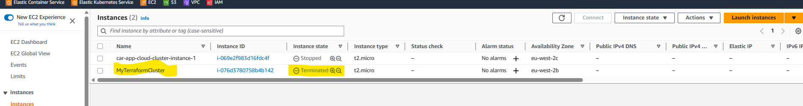<br>
##### Variable substitution in.tf
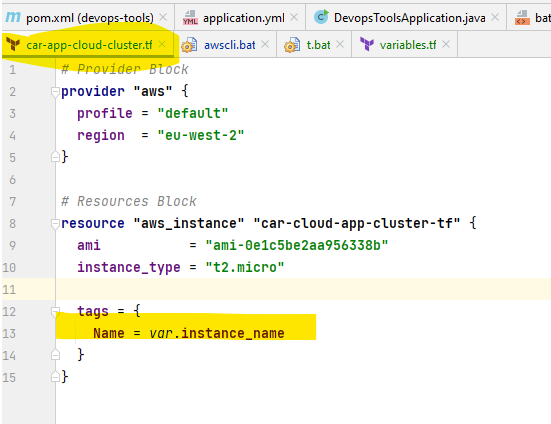<br>
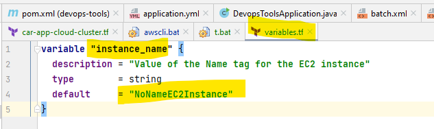<br>
Run ```terraform apply``` <br>
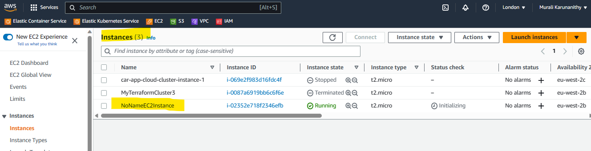<br>
Run ```terraform apply -var "instance_name=VarMyTerraformCluster4"``` <br>
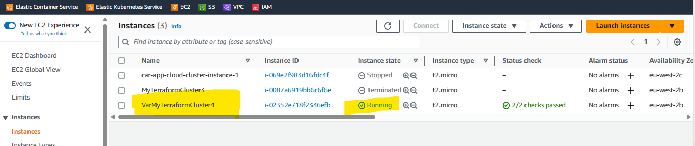<br>

##### Useful terraform commands
```terraform init```    -> Init the provider e.g. aws<br>
```terraform apply```   -> Setup infrastructure<br>
```terraform destroy``` -> Tear down infrastructure<br>

<a name="nomad"></a>
### Nomad

<a name="vault"></a>
### Vault