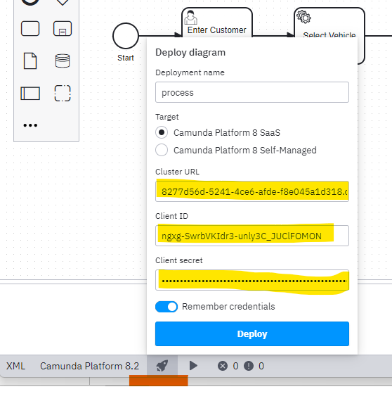

# Car Workflow Cloud App - AWS Deployment

[TOC]

# Header 1

## Header 2

## AWS Steps

## Create a key pair

## Create an ECS Cluster

## Create an EC2 Instance

## Create an S3 Bucket
#### Step 1

#### Step 2

#### Step 3


## Copy Spring Boot Jar to S3 bucket
#### Step 1

#### Step 2

#### Step 3

#### Step 4

#### Step 5

#### Step 6

#### Step 7

#### Step 8


## Log into EC2 Instance
#### Step 1

#### Step 2

#### Step 3

#### Step 4

#### Step 5
<br>
The file is e.g. `C:\gitprojects\security\aws\car-app-cloud-cluster\car-app-cloud-key.ppk`
#### Step 6
<br>

## Install Java (correct version) on EC2 instance
#### Step 1

#### Step 2
<br>

## Get the Spring Boot Jar from S3 bucket to EC2 Instnace

## Run Spring Boot Application


# *** IGNORE BELOW THIS***


## Get Started

Create a new Spring Boot project (e.g. using [Spring initializr](https://start.spring.io/)), or open a pre-existing one you already have. Create an account at [Camunda Platform 8 SaaS](https://console.cloud.camunda.io/).

## Configuring Camunda Platform 8 SaaS Connection

Connections to the Camunda SaaS can be easily configured, create the following entries in your `src/main/resources/application.yml`:

```yml
zeebe:
  client:
    cloud:
      region: ont-1
      clusterId: 8277d56d-5241-4ce6-afde-f8e045a1d318
      clientId: ngxg-SwrbVKIdr3-unly3C_JUClFOMON
      clientSecret: JUL7GZ4MUkK67PfOpjdYfCfnFRuZ2xQ8W6zsMe41qI5r3buRbmGRguiMBsdHYh3U
```

## Configuring Camunda Desktop Modeller

Add the following parameters here:

```code
Cluser URL: 8277d56d-5241-4ce6-afde-f8e045a1d318.ont-1.zeebe.camunda.io:443

Client ID: ngxg-SwrbVKIdr3-unly3C_JUClFOMON

Client Secret: JUL7GZ4MUkK67PfOpjdYfCfnFRuZ2xQ8W6zsMe41qI5r3buRbmGRguiMBsdHYh3U
```

## gRPC services and client
This is a gRPC client. It uses this project to make itself a gRPC servcice.
[grpc-spring-boot-starter](https://github.com/yidongnan/grpc-spring-boot-starter/). Read the [documentation](https://yidongnan.github.io/grpc-spring-boot-starter/en/) for details.

Add following dependency.
```pom.xml
<!--===== gRPC Server Spring Boot starter =====-->
<dependency>
    <groupId>net.devh</groupId>
    <artifactId>grpc-client-spring-boot-starter</artifactId>
    <version>2.14.0.RELEASE</version>
</dependency>
```

`com.interview.carworkflowcloud.services.config.GrpcStarterClientConfig` is needed as a fix for [https://github.com/yidongnan/grpc-spring-boot-starter/pull/775](https://github.com/yidongnan/grpc-spring-boot-starter/pull/775).
```java
@Configuration
@ImportAutoConfiguration({
        net.devh.boot.grpc.client.autoconfigure.GrpcClientAutoConfiguration.class,
        net.devh.boot.grpc.client.autoconfigure.GrpcClientMetricAutoConfiguration.class,
        net.devh.boot.grpc.client.autoconfigure.GrpcClientHealthAutoConfiguration.class,
        net.devh.boot.grpc.client.autoconfigure.GrpcClientSecurityAutoConfiguration.class,
        net.devh.boot.grpc.client.autoconfigure.GrpcClientTraceAutoConfiguration.class,
        net.devh.boot.grpc.client.autoconfigure.GrpcDiscoveryClientAutoConfiguration.class,
        net.devh.boot.grpc.common.autoconfigure.GrpcCommonCodecAutoConfiguration.class,
        net.devh.boot.grpc.common.autoconfigure.GrpcCommonTraceAutoConfiguration.class,
        net.devh.boot.grpc.common.autoconfigure.GrpcCommonCodecAutoConfiguration.class,
        net.devh.boot.grpc.common.autoconfigure.GrpcCommonTraceAutoConfiguration.class
})
class GrpcStarterClientConfig {
}
```

Following are needed. `spring.application.name` is the "name" the service registers on Consul. `spring.boot.admin.client.*` are details to register with Spring Boot Admin.
`spring.cloud.consul.*` are the properties to resister with Consul.

```yaml
spring:
  application:
    name: car-records-app
  boot:
    admin:
      client:
        # Where the Spring boot admin resides
        url: http://localhost:8100
        # When shut down deregisters from spring boot admin
        auto-deregistration: true
  cloud:
    consul:
      host: localhost
      port: 8500
      discovery:
        instanceId: ${spring.application.name}:${${spring.application.instance_id}:${server.port}:${random.value}}
      config:
        enabled: false
        #import: optional:configserver:http://myhost:8888
```

Define the gRPC stubs in its own `@Configuration` file

```java
@Configuration(value = "grpcStubConfig")
@GrpcClientBeans({
        @GrpcClientBean(
                clazz = RecordsServiceGrpc.RecordsServiceBlockingStub.class,
                beanName = "recordsServiceBlockingStub",
                client = @GrpcClient("car-records-app"))
})
class GrpcStubConfig {}
```

Then **IN A SEPERATE `@Configuration` file configure the beans with a `@DependsOn`**

```java
@Configuration
@DependsOn("grpcStubConfig")
class GrpcStubConfig2 {
    @Bean
    public FinaliseBooking finaliseBooking(
            @Autowired ZeebeClientWrapper zeebeClient,
            @Autowired DiscoveryClient discoveryClient,
            @Autowired RecordsServiceGrpc.RecordsServiceBlockingStub stub) {
        return new FinaliseBooking(zeebeClient, discoveryClient, stub);
    }
}
```