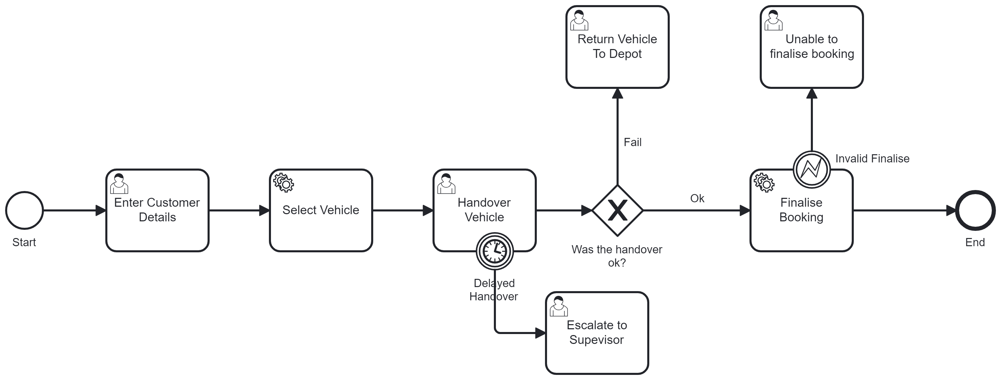
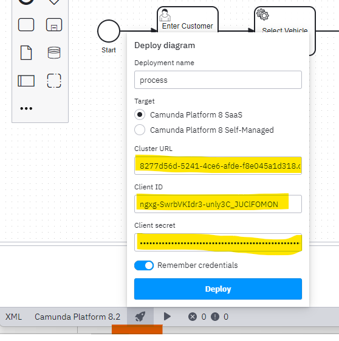

# Car Workflow Cloud App

## BPMN Diagram



## Get Started

Create a new Spring Boot project (e.g. using [Spring initializr](https://start.spring.io/)), or open a pre-existing one you already have. Create an account at [Camunda Platform 8 SaaS](https://console.cloud.camunda.io/).

## Configuring Camunda Platform 8 SaaS Connection

Connections to the Camunda SaaS can be easily configured, create the following entries in your `src/main/resources/application.yml`:

```yml
zeebe:
  client:
    cloud:
      region: ont-1
      clusterId: 8277d56d-5241-4ce6-afde-f8e045a1d318
      clientId: ngxg-SwrbVKIdr3-unly3C_JUClFOMON
      clientSecret: JUL7GZ4MUkK67PfOpjdYfCfnFRuZ2xQ8W6zsMe41qI5r3buRbmGRguiMBsdHYh3U
```

## Configuring Camunda Desktop Modeller

Add the following parameters here:

```code
Cluser URL: 8277d56d-5241-4ce6-afde-f8e045a1d318.ont-1.zeebe.camunda.io:443

Client ID: ngxg-SwrbVKIdr3-unly3C_JUClFOMON

Client Secret: JUL7GZ4MUkK67PfOpjdYfCfnFRuZ2xQ8W6zsMe41qI5r3buRbmGRguiMBsdHYh3U
```
